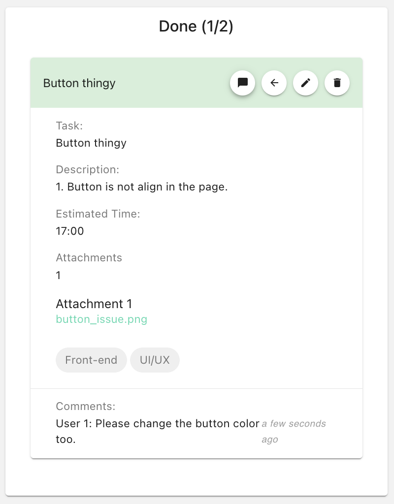

# Task Management App

### Built With

A simple and efficient task management application to help you stay organized and productive.

### Programming Language
* [![JavaScript][JavaScript]][JavaScript-url]

### Frameworks/Libraries
* [![Vue][Vue.js]][Vue-url]
* [![Vuetify][Vuetify.com]][Vuetify-url]
* [![Pinia][Pinia]][Pinia-url]


<!-- GETTING STARTED -->
## Getting Started

This is a task management application than can allow user to arrange their task. 


### Project Setup

```sh
npm install
```

### Compile and Hot-Reload for Development

```sh
npm run dev
```

### Compile and Minify for Production

```sh
npm run build
```

### Lint with [ESLint](https://eslint.org/)

```sh
npm run lint
```

## Features

Features that user can used in the app as follows:
1. **Create New Task**
    - User can create new task with title, description, upload file, estimated finished time, label and the  status of the task.
    - User can view the uploaded attachment of the task in a new tabs by clicking the attachment itself on the task card.

2. **Updating board/status on each task card**
    - User can either **drag and drop** the task on the board or **click the arrow on the up right corner** to change the tasks' status. 

3. **Search Bar**
    - User can use the search bar to search the task by task fields (e.g. title, description, label).

4. **Progression Bar**
    - Progress bar is provided at the top to calculate progress for the tasks that are **done** automatically. It will updated whenever the task is moved to the done board or any task is newly added.


5. **Commentbox**
    - is also available for the user to leave their comments on the respective task. Time and Username will be recorded.



6. **Edit & Delete task**
    - Edit & Delete task is available for the user by clicking the edit & delete button.


<!-- MARKDOWN LINKS & IMAGES -->
[Vue.js]: https://img.shields.io/badge/Vue.js-35495E?style=for-the-badge&logo=vuedotjs&logoColor=4FC08D
[Vue-url]: https://vuejs.org/
[Vuetify.com]: https://img.shields.io/badge/Vuetify-1867C0?style=for-the-badge&logo=vuetify&logoColor=ffffff
[Vuetify-url]: https://vuetifyjs.com/

[JavaScript]: https://img.shields.io/badge/JavaScript-F7DF1E?style=for-the-badge&logo=javascript&logoColor=000000
[JavaScript-url]: https://www.javascript.com/

[Pinia]: https://img.shields.io/badge/Pinia-10B981?style=for-the-badge&logo=vue.js&logoColor=white
[Pinia-url]: https://pinia.vuejs.org/getting-started.html

